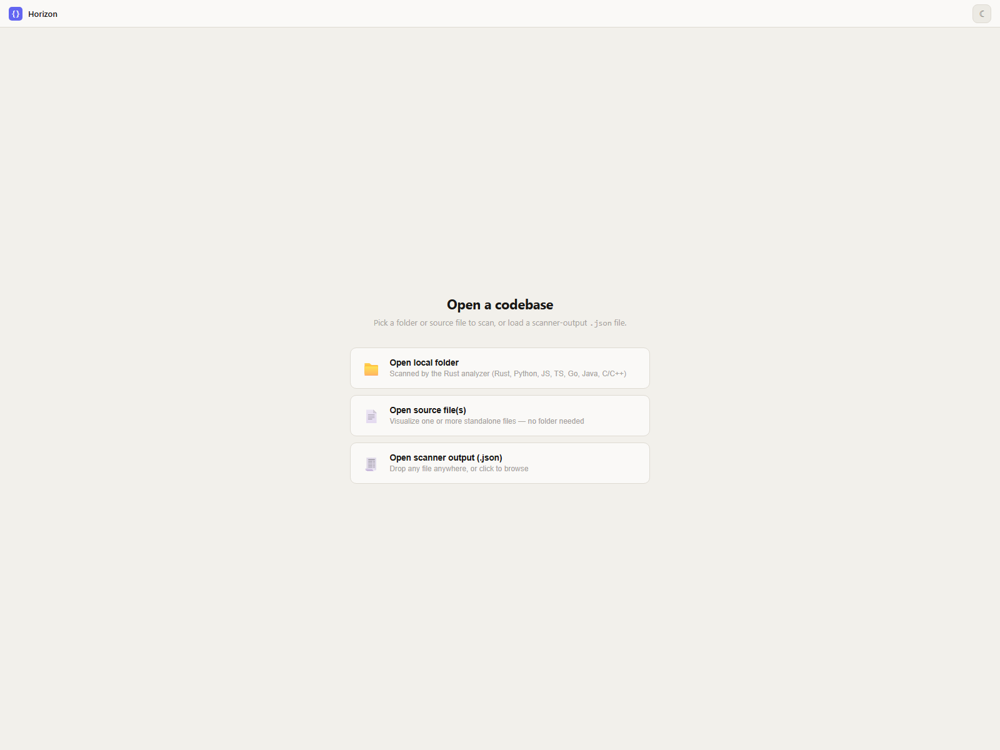
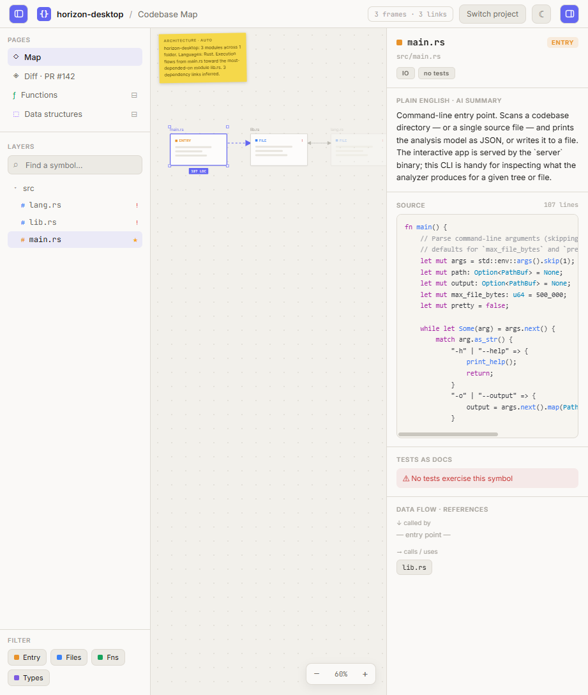
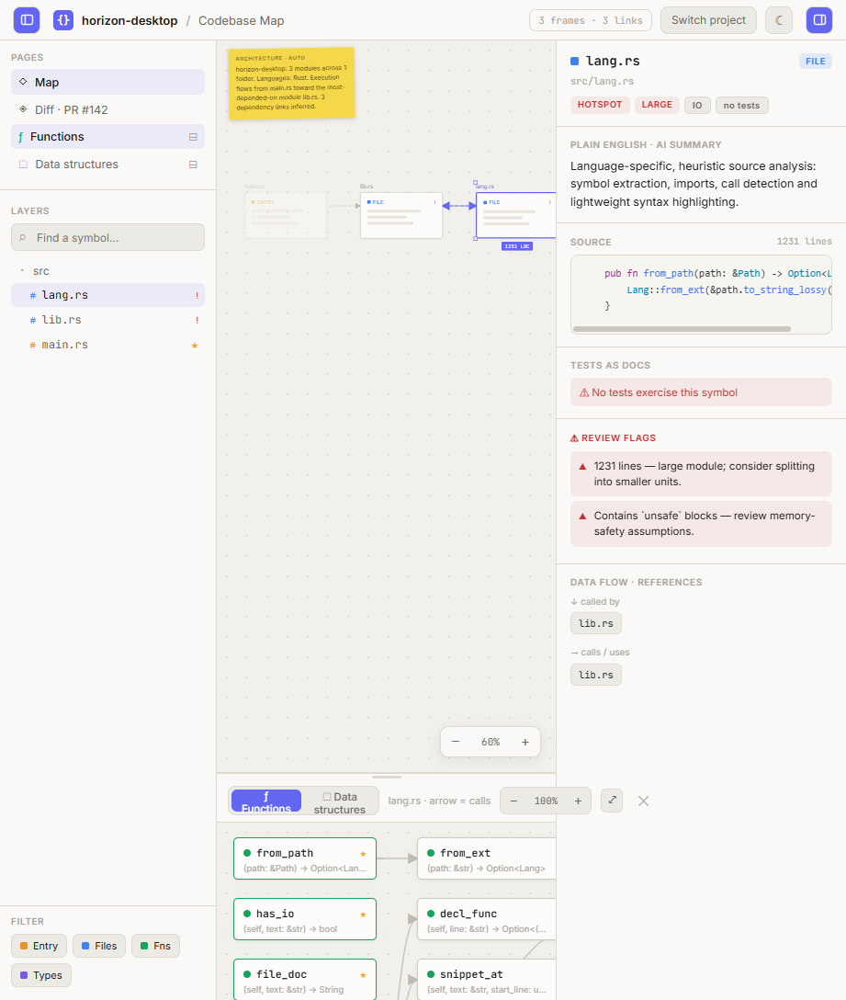
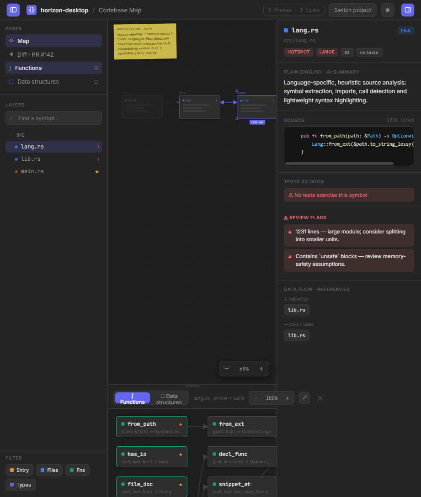

# Desktop Horizon UI — implementable specification

Faithful specification of the pre-rewrite UI at
`C:\Users\kouat\OneDrive\Desktop\Horizon\` so it can be rebuilt against the
current Horizon function-map contract
([`map.rs`](../../crates/horizon-map/src/map.rs)).

Sources studied (read-only): `web/index.dc.html`, `web/support.js`,
`src/bin/server.rs`, `src/lib.rs`, `src/lang.rs`, `Cargo.toml`, `README.md`.
Compared to branch `my-local-name` @ `32cb6b18c14638afc4730b9a0993c35df08ce7dd`,
[`branch-ui-survey.md`](branch-ui-survey.md), and
[`old-viewer-spec.md`](old-viewer-spec.md). Contrasted with the living viewer in
`crates/horizon-server/web/`.

---

## 0. Lead answers

### Identification

**Same product as the `my-local-name` Codebase Visualizer / DC UI, not identical
to tip `32cb6b1`.** Closest description: **divergent fork of that UI, slightly
behind the tip’s selection-isolation polish, with a package rename to `horizon`
and Unicode/encoding cleanups.**

| Artifact | Desktop (OneDrive) | `my-local-name` tip blob | Verdict |
|---|---|---|---|
| `web/support.js` | git hash-object `61b2d17…` | `61b2d17…` | **Byte-identical** |
| `web/index.dc.html` | `3d60bcf…` (93 280 B) | `3b4d6dd…` (branch larger) | **Divergent** |
| `src/bin/server.rs` | `e60a559…` | `5ef29a5…` | Rename + comment/encoding |
| `src/lib.rs` | `4196724…` | `d424242…` | Rename + encoding + small API move |
| `Cargo.toml` | package `horizon` 0.2.0 | package `codebase_visualizer` 0.2.0 | **Renamed** |

**What actually differs in `index.dc.html` vs tip**

- Tip commit `32cb6b1` added **text-selection isolation**: CSS
  `[data-cv-section]`, attributes `data-cv-section` / `data-cv-canvas` on panels,
  `selectionchange`/`copy` listeners, and drag-yield when selecting text. Desktop
  **lacks all of that** (≈90 lines of tip-only behaviour).
- Empty-state brand string: tip `"Codebase Visualizer"` → Desktop `"Horizon"`.
- No other layout/IA/feature delta large enough to treat Desktop as a different
  design. Canvas, inspector, bottom DAG, import flow, tokens, and Model contract
  match the survey.

**Modification times (Desktop tree)**

| Path | Size | LastWriteTime |
|---|---:|---|
| `web/support.js` | 73 580 | 2026-06-20 21:12 |
| `src/lang.rs` | 51 423 | 2026-07-17 10:43 (matches tip commit time) |
| `Cargo.toml` | 498 | 2026-07-25 12:08 |
| `web/index.dc.html` | 93 280 | 2026-07-25 12:09 |
| `src/lib.rs` | 49 529 | 2026-07-25 12:09 |
| `src/bin/server.rs` | 12 973 | 2026-07-25 12:09 |
| `README.md` | 2 256 | 2026-07-25 12:09 |

Interpretation: runtime unchanged since June; analyzer/`lang.rs` aligned with
the 17 Jul tip; on **25 Jul** the Desktop copy was rebranded to `horizon` and
the HTML lost (or never received) the tip’s selection-isolation patch.

`.dc.` in `index.dc.html` means **Design Component** (declarative `<x-dc>` +
`support.js` runtime), **not** “data-contained”. The page opens **empty**; it
does not embed a map. Data arrives via `POST /api/scan` or a loaded scanner
`.json`.

### Mapping conclusions (read first)

| Old UI concept | New contract feed | Gap |
|---|---|---|
| Canvas **file cards** (`nodes[]`, `kind`, `x`,`y`,`loc`) | One card per `File` (optionally per `Crate` as a frame). Positions **must be computed client-side** — map has no `x`/`y` | Layout engine required |
| File **dependency edges** (`edges[][]`) | **No file-dep graph.** Closest: aggregate `CallSite`s whose `target` resolves across files → directed file→file edges; or drop edges and show containment only | Semantic change |
| Bottom **function DAG** (`sub.fns`, `fnx`) | `Function` + ordered `call_sites` with `Resolved` → edge to that `FunctionId` | Conflicts/unresolved need node/edge chrome the old DAG never had |
| Bottom **struct DAG** (`sub.structs`, `fieldx`) | **Cannot supply** — types/`impl`/methods out of scope | Drop Data-structures page or show honest empty state |
| Inspector **Source** (`detail.code` / `FnOut.code`) | `GET /api/source?path&byte_start&byte_end&expected_hash` → `{tokens:[[text,class],…]}` using `Function.byte_*` + `File.content_hash` | Async; stale/missing/unverifiable states; file preview needs a chosen range (e.g. whole file or first fn) |
| Callers / callees chips | Invert `CallSite` edges over `FunctionId` index; file-level chips = unique files of those functions | Labels are ids/names, not heuristic file labels |
| Hot `!` / risks / badges / tests / “AI summary” / arch sticky | Partially: `doc_comments`, `MapSummary`, conflict/unresolved counts. **No** tests index, **no** LARGE/ORPHAN/unsafe badges, **no** generated English arch paragraph | Do not invent LLM text; use docs + summary counters |
| Diff · PR #142 | Nothing | Keep as stub or remove |
| Multi-language kinds | Rust-only map | Drop Python/JS/… import UX or gate it |

---

## 1. Screenshots

Captured with headless / CDP Edge against the Desktop server on
`http://127.0.0.1:8787` (file:// alone only shows the empty import screen).
Sample data: Desktop’s own `src/{main,lib,lang}.rs` via `POST /api/scan`.









Also saved: `desktop-horizon-inspector.png` (dark, inspector-focused; same layout
as dark shot).

**Visual read from the pixels (not just CSS):**

- Light theme is a **warm off-white** workspace (`#f2f0eb`), not pure white;
  panels are slightly cream (`#faf9f7`).
- Center is a **dot-grid canvas** with Figma-like file frames (skeleton bars
  inside, not live code).
- Yellow **Architecture · auto** sticky sits rotated on the canvas.
- Kind accents are vivid: entry orange, file blue, fn green, types purple;
  selection chrome is indigo `#6366f1`.
- Right inspector is a dense vertical stack of labelled sections; source is a
  dark/light code well with coloured token spans.
- Bottom panel is a second graph world (green dots, signatures truncated), not
  a list.

---

## 2. Layout and visual design

### Regions (loaded state)

```
┌─ header 44px ─────────────────────────────────────────────────────────────┐
│ [≡] { } project / Codebase Map     …stats…  Switch  ☾/☀  [≡]              │
├──────────┬────────────────────────────────────────────┬───────────────────┤
│ LEFT     │ CENTER (flex column)                       │ RIGHT             │
│ default  │  ┌─ main canvas (flex:1, dot grid) ──────┐ │ default 316px     │
│ 236px    │  │ sticky · SVG edges · file cards · zoom│ │ Inspector         │
│ Pages    │  └───────────────────────────────────────┘ │ identity→…→refs   │
│ Layers   │  ┌─ bottom panel (optional, ~248px) ─────┐ │                   │
│ Filter   │  │ tabs · scope · fn/struct DAG · zoom   │ │                   │
│          │  └───────────────────────────────────────┘ │                   │
└──────────┴────────────────────────────────────────────┴───────────────────┘
         ↔ drag rails (11px hit) over left/right boundaries
```

| Region | Sizing / arrangement |
|---|---|
| Root | `height:100vh; minHeight:700px; flex column; overflow:hidden` |
| Header | `height:44px; padding:0 14px; z-index:40; border-bottom` |
| Left aside | `leftW` default **236**, min **180**; collapse → width `0` |
| Right aside | `rightW` default **316**, min **240**; collapse → width `0` |
| Resize rails | absolute, `width:11px`, `z-index:35`, `cursor:ew-resize`; hover `rgba(13,153,255,.28)` |
| Canvas world | fixed **1360×600** px, `transform: translate(pan) scale(zoom)` |
| File card | **W=150, H=84** |
| Grid | `radial-gradient(var(--grid) 1.2px, transparent 1.2px)` / `22px 22px` |
| Bottom dock | default height **248**, drag min 120; pull to top → `subFullView` |
| Bottom handle | height **7px**, `cursor:ns-resize` |
| Sub-node | **NW=156, NH=46**; gaps `GX=200, GY=66`; pad `PADX=18, PADY=16` |
| Zoom main | default `0.6`, step `±0.12`, clamp `[0.45, 1.5]` |
| Zoom sub | default `1`, step `±0.15`, clamp `[0.5, 2]` |
| Import column | `max-width:480px` centered |
| Sticky | `left:22; top:14; width:228; rotate(-1deg)` |

### Colour palette (`tokens(dark)`)

| Token | Dark | Light | Role |
|---|---|---|---|
| `--bg` | `#1e1e1e` | `#f2f0eb` | Page / canvas ground |
| `--grid` | `#272727` | `#e3e0d9` | Dot grid |
| `--panel` | `#252525` | `#faf9f7` | Chrome surfaces |
| `--panel2` | `#313131` | `#eceae4` | Recessed controls |
| `--border` | `#3a3a3a` | `#dedad2` | Hairlines |
| `--text` | `#e2e2e2` | `#1a1917` | Primary |
| `--text2` | `#949494` | `#6b6860` | Secondary |
| `--text3` | `#5e5e5e` | `#a8a49d` | Tertiary / labels |
| `--sel` | `#6366f1` | `#6366f1` | Selection / hot edges |
| `--selbg` | `rgba(99,102,241,.18)` | `rgba(99,102,241,.1)` | Selected row fill |
| `--frame` | `#2e2e2e` | `#fdfcfb` | Card face |
| `--frameborder` | `#484848` | `#ccc9c1` | Card border |
| `--code` | `#161616` | `#f7f5f0` | Source well |
| `--conn` | `#424242` | `#bdbab2` | Idle edge stroke |
| `--sticky` / `--stickytxt` | `#c9b84a` / `#2a2208` | `#f5d84a` / `#3d2e00` | Arch note |
| `--warn` / `--warnbg` | `#f87171` / `rgba(248,113,113,.12)` | `#c53030` / `rgba(197,48,48,.08)` | Risks / no-tests |
| `--okbg` | `rgba(22,163,92,.12)` | `rgba(22,163,92,.09)` | Test rows |
| `--shadow` | `rgba(0,0,0,.5)` | `rgba(0,0,0,.07)` | HUD shadows |
| `--scroll` | `#444444` | `#cac7bf` | Scrollbar thumb |
| `--skel` | `#404040` | `#e8e5de` | Fake code bars on cards |
| `--toolbar` | `#1a1a1a` | `#28261f` | Defined, unused in template |

**Kind accents (constants, not CSS vars):**

| Kind | Hex | Notes |
|---|---|---|
| entry | `#e8922a` | star `#f5a623` |
| file | `#3b82f6` | |
| fn | `#16a35c` | Pages icon `#14ae5c` |
| struct | `#7c5be0` | Pages DS `#9747ff` |
| Diff added / changed / removed | `#14ae5c` / `#f5a623` / `#e5484d` | |
| Hot badge | `#e5484d` | |

### Syntax colours (`codeEl`)

| Class | Dark | Light |
|---|---|---|
| `kw` | `#c586c0` | `#a626a4` |
| `fn` | `#dcdcaa` | `#4078f2` |
| `ty` | `#4fc1ff` | `#0184bc` |
| `c` | `#6a9955` | `#a0a1a7` |
| `""` | `#d4d4d4` | `#383a42` |

New `/api/source` also emits `str` and `num`; this UI has **no styles** for them
— map those to distinct colours when rebuilding (see current viewer CSS).

### Typography

| Use | Spec |
|---|---|
| Fonts | Google Fonts: **Inter** 400–700 + **JetBrains Mono** 400–600 |
| Root UI | `Inter, system-ui, sans-serif`, `13px` |
| Section labels | `10px`, weight 600, `letter-spacing:.6px`, uppercase, `--text3` |
| Brand / project | Inter 600, 13px |
| Import title | 22px / 700 / `letter-spacing:-.4px` |
| Code | JetBrains Mono 11px, line-height 1.6 |
| Card kind chip | ~9–10px uppercase |
| Mono paths / stats | JetBrains Mono 10–10.5px |

### Global CSS quotes

```css
*{box-sizing:border-box}
html,body{margin:0;padding:0;user-select:none}
input,textarea,select{user-select:text}
::-webkit-scrollbar{width:10px;height:10px}
::-webkit-scrollbar-thumb{background:var(--scroll);border-radius:6px;border:2px solid transparent;background-clip:padding-box}
@keyframes cvdash{to{stroke-dashoffset:-16}}
```

---

## 3. Information architecture

**Primary metaphor:** a **Figma-style spatial map of files**, not a containment
tree and not a call-site diagnostics list.

| Layer | What it is | Selection effect |
|---|---|---|
| **Pages** | Mode switch: Map / Diff stub / open Functions / open Data structures | Diff toggles border colours; Fn/DS open bottom panel |
| **Layers** | Folder → file tree (from `folders[]`) | Click file → `selectedId` (+ shift multi-select) |
| **Filter chips** | Kind visibility: entry / file / fn / struct | Dim unmatched cards (`opacity:0.32`), do not remove |
| **Center canvas** | Positioned file cards + dependency edges | Click selects; hover highlights incident edges; drag moves cards; pan/zoom world |
| **Bottom panel** | Per-file (or multi-file) **symbol call/composition DAG** | Click symbol → `selectedSym` overrides inspector |
| **Inspector** | Master-detail for selected file **or** symbol | Callers/callees jump selection |

**Navigation paths**

1. Import → scan/JSON → auto-select `kind==='entry'` else first node.
2. Layers or canvas → file → inspector (summary, source preview, tests, risks, refs).
3. Pages → Functions → bottom DAG → symbol → inspector shows **full symbol body**.
4. Inspector chips → jump to related file or symbol.
5. Switch project → back to import (model remains in memory until replaced; Recent restores from `localStorage`).

**What is selectable**

- File node ids (`selectedId`, `selectedSet[]`).
- Symbol keys `"fileId:symId"` (`selectedSym`) — wins over file in inspector.
- Not selectable as first-class: folders (toggle only), edges, sticky note, Diff PR.

**Contrast with current `horizon-server` viewer:** that UI’s primary metaphor is
**containment tree + call-site cards** with conflict/unresolved filters. This
Desktop UI’s primary metaphor is **spatial file graph + symbol subgraph**. The
owner now wants *this* IA as the target design — so the rebuild must re-express
call resolution **inside** map/inspector chrome, not abandon the map for a tree.

---

## 4. Component inventory

| Component | Data shown | States |
|---|---|---|
| **Top bar** | Brand `{}`, `projectName`, “/ Codebase Map”, frame stats, Switch, theme, panel toggles; sub-full chrome when expanded | import vs loaded; light/dark; left/right open |
| **Import screen** | Three open actions, error banner, Recent chips | idle / error / hasRecent |
| **Scanning screen** | Progress bar, current file label | `current/total` |
| **Version banner** | Warning if `version` ≠ `"1"` or missing | visible / dismissed |
| **Pages buttons** | Map, Diff · PR #142, Functions, Data structures | active page / bottom tab |
| **Search** | `query` | filters layers + dims canvas |
| **Layer row** | folder / file / vendor | collapsed folder; selected file; badge `!` or `★` |
| **Filter chip** | kind label + colour square | on/off |
| **Architecture sticky** | `arch` string | present when `hasData` |
| **File card** | label, kind chip, skeleton bars, optional `!`, LOC pill when selected | idle / hover-linked / selected / dimmed / orphan / diff border |
| **Edge path** | cubic bezier between cards | idle / hot (animated dash) / dead (orphan target, dashed) |
| **Zoom HUD** | percent | |
| **Diff legend** | added/changed/removed | only `view==='diff'` |
| **Bottom chrome** | Fn/DS tabs, multi-select modes (All / By file / Linking / Bridges), file pick, info, zoom, expand, close | docked / full / empty message |
| **Sub-node** | colour dot, label, sig, optional ★ entry / bridge dash | selected / hover / bridge |
| **Inspector identity** | colour, label, kind chip, path, badges | file vs symbol |
| **AI summary** | `summary` or synthesized | |
| **Source block** | `loc` + highlighted `code` | empty fallback comment |
| **Tests as docs** | green rows or warn “No tests…” | |
| **Review flags** | `risks[]` | section omitted if empty |
| **Data flow chips** | callers / callees | clickable; “— entry point —” |

---

## 5. Source / Inspector panel

### Placement and chrome

Right aside, scrollable column. Section order:

1. Identity (padding `13px 15px`, bottom border)
2. **Plain English · AI summary**
3. **Source** — header “SOURCE” + `{{ sel.loc }} lines`; body:

```html
<pre style="margin:0;background:var(--code);border:1px solid var(--border);
  border-radius:8px;padding:11px 12px;overflow-x:auto;
  font-family:'JetBrains Mono',monospace;font-size:11px;line-height:1.6">
  <code>{{ sel.codeEl }}</code>
</pre>
```

4. Tests as docs  
5. Review flags (conditional)  
6. Data flow · references  

Selection precedence: `selectedSym` → `symDetail` else `detail(selectedId)`.

### Token markup

Wire: `Array<[text, class]>` with `class ∈ {kw, fn, ty, c, ""}`. Rendered by
`codeEl` as nested `<span style={{color}}>` — **no** Prism/Highlight.js, **no**
line numbers, **no** call-site range highlighting inside the well.

### How old bytes were obtained

At scan time only (no live disk read for display):

| Level | Slice | Cap |
|---|---|---|
| File `detail.code` | Heuristic start (`main` / pub fn / …) | **18** lines |
| Symbol `code` | Brace/indent from start line | **4000** lines |

Then `highlight` → token pairs embedded in Model JSON.

### Rebuild against `/api/source`

| Old | New |
|---|---|
| Sync embedded arrays | Async `GET /api/source` |
| Classes `kw/fn/ty/c/""` | Same plus `str`, `num` |
| Always available after scan | Can fail: `stale`, `missing`, `unverifiable`, `no_source`, `not_in_map`, `range` |
| File preview 18 lines | Choose range: e.g. first function’s `byte_*`, or whole file if server allows |
| Symbol body | `Function.byte_start`/`byte_end` + `File.path` + `content_hash` |

Inspector should keep the same **section chrome**, replace the data path with
loading / banner / token render (as Phase C viewer already prototypes).

---

## 6. Complete interaction list

| Trigger | Effect | Feedback |
|---|---|---|
| Theme button | Toggle `dark`, pin `userSet` | ☾ ↔ ☀; all tokens swap |
| OS prefers-color-scheme | Update `dark` if `!userSet` | |
| Toggle left / right | Collapse/expand sidebars | width 0 vs `leftW`/`rightW` |
| Drag left/right rail | Resize (≥ mins) | live width |
| Switch project | `appState='import'` | import screen |
| Open folder / files / json | Hidden `<input>` click | OS picker |
| Drop on import | Prefer `.json`, else sources | load or ingest |
| Recent chip | `loadModel` from `localStorage` | loaded view |
| Pages → Map | `view='map'`, exit full | |
| Pages → Diff | `view='diff'` | legend + optional borders |
| Pages / tabs → Functions / DS | `bottomOpen`, set tab | bottom panel |
| Search input | `query` | dim non-matches |
| Folder row | Toggle `collapsed[name]` | ▸/▾ |
| File row / card click | `select(id)`; Shift adds to `selectedSet` | indigo selection, LOC pill |
| Card hover | `hoverId` | hot edges |
| Card drag (>5px) | Update `nodePos[id]` | move card |
| Canvas empty drag | Pan | |
| Zoom − / % / + | zoomOut / reset 0.6 / zoomIn | HUD |
| Bottom resize drag | Change `bottomH`; near top → full | |
| Expand / Dock / Close | full / dock / close bottom panel | |
| Sub empty drag | Pan sub | |
| Sub node click | `selectedSym` | inspector swaps to symbol source |
| Sub node drag | `subPos` | |
| Scope mode buttons | `subScope` union/single/connecting/bridge | graph filter |
| File `<select>` | `subFilePick` | single-file mode |
| Caller/callee chip | `select` / `selectSym` | jump |
| Clear import error / version ✕ | Clear | |
| Keyboard shortcuts | **None** | native focus only |

**localStorage:** `cv_recent` (max 5 `{name,lang,ts,key}`); `cv_proj_${name}` =
full Model JSON.

---

## 7. Data contract the UI consumes

### Endpoints (Desktop `server.rs`)

| Method | Path | In | Out |
|---|---|---|---|
| `GET` | `/` or `/index.html` | — | embedded `index.dc.html` |
| `GET` | `/support.js` | — | embedded `support.js` |
| `GET` | `/api/health` | — | `{"ok":true}` |
| `GET` | `/api/scan-path` | `?path=` | `Model` JSON (**UI never calls**) |
| `POST` | `/api/scan` | `{ name?: string, files: [{path,text}] }` | `Model` JSON |
| other `/api/*` on loopback + bad Host | — | **403** `{error}` |
| else | — | **404** `Not found` |

Bind: `127.0.0.1:8787` (`HOST`/`PORT` env). Body cap **64 MiB**. Per-file skip
in UI/scanner path: **500 000** bytes. Max files uploaded: **5000**.

### Model shape (exact fields the UI reads)

```text
Model {
  version: "1"
  repoName, language, arch
  nodes: NodeOut[]
  edges: [fromId, toId][]
  detail: { [nodeId]: DetailOut }
  folders: FolderOut[]
  sub: { [fileId]: { fns: FnOut[], structs: StructOut[] } }
  fnx: [fileFrom, symFrom, fileTo, symTo][]
  fieldx: [fileFrom, typeFrom, fileTo, typeTo][]
}
```

| NodeOut | DetailOut | FnOut / StructOut |
|---|---|---|
| `id, label, kind, x, y, loc, diff?, orphan` | `path, summary, code[][], loc, tests[], callers[], callees[], risks?, badges?` | `id, label, sig, calls\|fields, code[][], loc, doc?` |

`kind ∈ {entry,file,fn,struct}`. Analyzer always omits `diff`. `code` tokens:
`[text, class]`. Callers/callees on **files** are **labels** of neighbor files;
on **symbols**, inspector rebuilds from local `calls`/`fields`.

`validateModel`: requires non-empty `nodes`; edge endpoints in node ids; `fnx` /
`fieldx` file ends exist in `sub`.

---

## 8. Mapping section — old UI × new `Repository` contract

### 8.1 Structural correspondence

```text
Old                              New
─────────────────────────────    ────────────────────────────────────────
(no repo root row)               Repository.root + summary
folders[].name + files[]         Crate → Folder.path → File.path
                                 (add Crate rows; Desktop folders are flat)
nodes[] file cards               File (one card each); optional Crate frame
nodes kind entry/file/fn/struct  entry≈bin root file; fn/struct cards rare
                                 (classifier heuristics) — new map: File + Function only
edges[] file deps                DERIVE from cross-file Resolved CallSites
                                 or omit; never invent import edges
sub[file].fns + fnx              File.functions + CallSite.target
sub[file].structs + fieldx       UNAVAILABLE (out of scope)
detail[file]                     synthesize from File + aggregates
FnOut.code                       GET /api/source(Function.byte_*)
```

### 8.2 Per-region feed

| UI region | Feed from new map | Cannot feed / new work |
|---|---|---|
| Import “Open folder” | Server must analyze repo → `Repository` (today’s CLI/server), not heuristic multi-lang upload | Drop non-Rust extensions or show unsupported |
| Layers tree | `crates[]` → folders/files | Show `lib`/`bin` (`is_library`); path is absolute — display basename + relative |
| Filter chips | Replace fn/struct with **resolved / conflict / unresolved / macro** or keep kind chips only for file/entry | Old struct chip obsolete |
| Canvas cards | Each `File`: label=basename, loc≈line span or fn count, hot if subtree conflicts/unresolved>0 | No `orphan` unless defined as “no inbound resolved calls” |
| Canvas edges | Aggregate resolved calls file→file; optional dashed for conflict-only | Unresolved has no target file — tip or self-loop badge, don’t guess |
| Sticky arch | Optional: template from `MapSummary` + crate names | Do **not** claim AI; old English generator gone |
| Bottom Functions | Nodes = `Function`; edge A→B if some `CallSite` of A has `Resolved(B)` | **Conflict:** multi-target edge or conflict stub node; **Unresolved:** sink node or list-only |
| Bottom Data structures | — | **Remove or permanently empty** with copy that methods/types are out of scope |
| Inspector summary | Join `doc_comments[].text`; else short factual line (module path, fn count) | No tests / risks / LARGE badges unless recomputed honestly |
| Inspector source | `/api/source` | Handle error kinds; show `from_macro` on call list, not in token stream |
| Data flow | Build caller index: for each site with `Resolved(id)`, edge caller→id | Conflict: chip “N candidates” expanding to jumps; Unresolved: show `reason`, no jump |
| MapSummary | Surface in header stats or sticky: conflicts, unresolved, external/constructor/associated dropped | Old UI had no place — **add** a summary strip |
| `from_macro` | Badge on call-site rows (borrow old-viewer `macro` pill) | Old UI ignored it |
| `content_hash` | Pass as `expected_hash` | On `stale`, refuse slice + prompt re-scan |
| Diff page | — | Drop or leave stub |

### 8.3 Conflict / Unresolved / macro — recommended chrome

Old model had **no** such concepts. Steal presentation from
[`old-viewer-spec.md`](old-viewer-spec.md), place it where this UI already shows
stress:

| Signal | Where in Desktop chrome |
|---|---|
| Conflict count | Layer badge (replace/coexist with `!`); card corner; inspector call list amber |
| Unresolved count | Same, red |
| Candidate list | Inspector under a call chip / bottom-panel conflict node → jump links by `FunctionId` |
| Reason strings | Subtext under conflict/unresolved (as viewer `.reason`) |
| `from_macro` | Small “macro” badge on site |
| Exclusion counters | Header or sticky footnote — not as call sites |

Do **not** collapse Conflict to a single guessed edge; that violates the map’s
non-guessing rule.

### 8.4 Source embedding vs on-demand

| | Desktop old | New design |
|---|---|---|
| When highlighted | Scan time | Fetch on select |
| Slice key | start line + brace walk | UTF-8 `byte_start`/`byte_end` |
| Freshness | Frozen snapshot | Hash check |
| Offline JSON | Full code in file | Map JSON alone insufficient for source panel |

Rebuild: keep Inspector Source **layout**; wire to `/api/source`. For “Open
scanner `.json`” without a live server, either disable Source or require the
horizon-server map load path that also `POST`s the map into server state (as
current viewer does).

### 8.5 Explicit non-goals (do not invent substitutes)

- Methods, `impl` / `trait` items, associated functions (counted in
  `associated_dropped` only).
- Multi-language heuristic scan.
- True PR diff.
- LLM “AI summary”.
- Test discovery (“Tests as docs”).
- `unsafe` / fan-in risk essays from the old analyzer.

---

## 9. Honest assessment

### Worth rebuilding (high value)

- Overall **three-pane + bottom DAG** composition and light/dark tokens.
- Spatial **file map** as overview (if edges are redefined honestly from
  CallSites).
- Inspector pattern: identity → docs → **Source** → references.
- Resizable panels, theme, Recent projects (store new `Repository` JSON).
- Bottom **function** graph with jump-to-definition via Resolved targets.

### Unfinished / broken / do not port as-is

- **Diff · PR #142** — decorative stub; `diff` never emitted.
- **GitHub URL** state — unwired.
- **“Plain English · AI summary”** — template/heuristic, not AI.
- Card **skeleton bars** — fake; not source.
- Tip’s **selection isolation** missing on Desktop (port from `32cb6b1` if
  rebuilding).
- Heuristic call/import edges — product reason this UI was deleted in
  `dda97d2`.
- Data-structures page — incompatible with current analyser scope.

### Effort vs current simpler viewer

| Approach | Effort (order of magnitude) | Fit |
|---|---|---|
| **A. Restyle `horizon-server` tree viewer** to Desktop colours/fonts + add a denser inspector | ~3–7 days | Keeps correct contract; weak on “Figma map” IA |
| **B. Rebuild Desktop look + IA on new contract** (canvas layout, bottom fn DAG, inspector, `/api/source`, conflict chrome) | ~3–6 weeks for one strong frontend engineer | Matches owner intent (“same as Desktop”) |
| **C. Port Desktop HTML and adapt Model with a giant adapter** | Looks faster, fails honesty — adapters will lie about edges/structs/tests | **Do not** |

**Recommendation:** **B over A**, because the owner explicitly set Desktop as
the target design — but **do not** revive the old Model or multi-lang scanner.
Keep the current viewer’s contract handling (tree index, filters, jump,
`/api/source`) as the **data layer**, and rebuild Desktop chrome around it.
Treat Data-structures / Diff / AI-summary / tests / risks as cut or replaced by
MapSummary + docs + conflict/unresolved UI.

If schedule is tight: ship **A** first (restyle + inspector source + summary
pills), then add canvas as a second view (`Tree | Map`) so the metaphor lands
without blocking correctness.

---

## 10. Contrast: Desktop DC UI vs throwaway / current viewer

| | Desktop (`index.dc.html`) | Old Map Viewer / `horizon-server` web |
|---|---|---|
| Contract | Heuristic `Model` | `Repository` function map |
| Primary IA | Spatial file graph + symbol DAG | Containment tree + call-site lists |
| Source | Embedded tokens | On-demand `/api/source` (server) / none (throwaway) |
| Conflict / unresolved | Absent | First-class |
| Theme | Light + dark | Dark-only (throwaway); evolving in server |
| Runtime | DC + React via `support.js` (~73 KB) + ~93 KB app | Plain HTML/CSS/JS |
| Unfinished stubs | Diff, AI label, GitHub | Jump brute-force, etc. (see old-viewer-spec) |

---

## 11. File roles (Desktop tree)

| Path | Role |
|---|---|
| `web/index.dc.html` | Entire app UI + logic (`DCLogic` class) |
| `web/support.js` | Generated DC runtime (React host, template compiler) — no Horizon logic |
| `src/bin/server.rs` | `tiny_http` static+API |
| `src/lib.rs` | Analyzer → `Model` |
| `src/lang.rs` | Lex/snippet/highlight heuristics |
| `src/main.rs` | CLI JSON dump |
| `Cargo.toml` | `horizon` 0.2.0, `default-run = "server"` |
