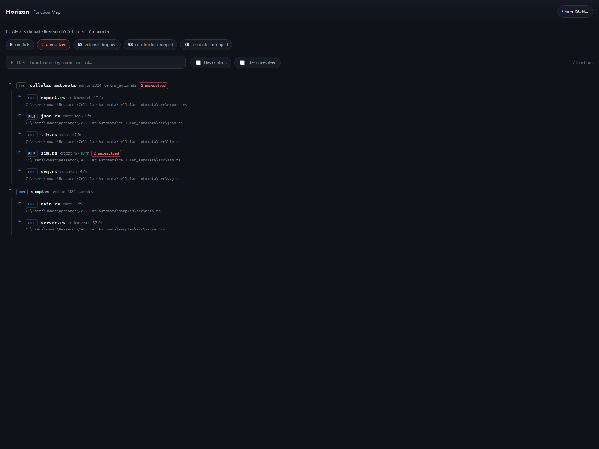
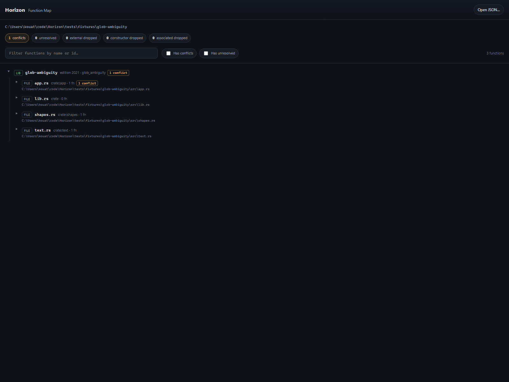
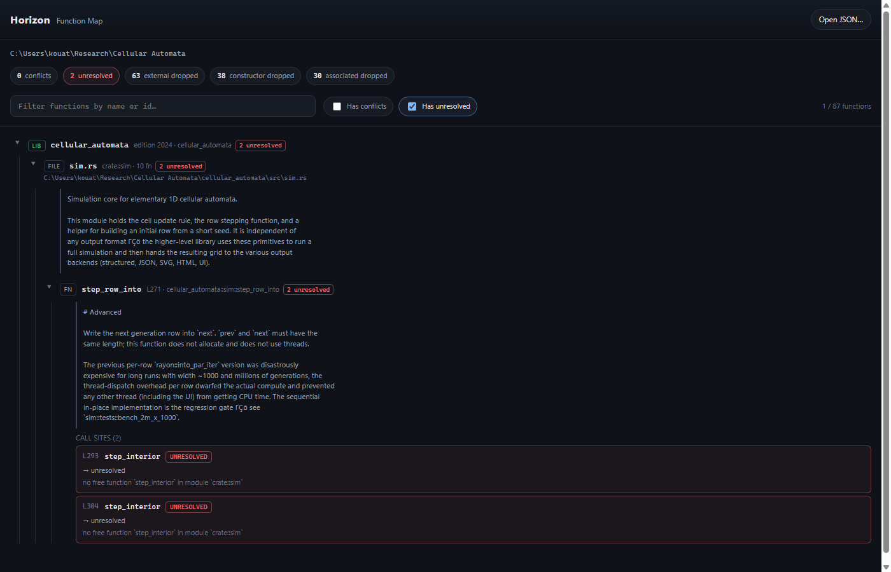

# Horizon Map Viewer — UI Specification (throwaway HTML/JS)

Faithful specification of the throwaway viewer at
`C:\Users\kouat\OneDrive\Desktop\Horizon Map Viewer\`, for reimplementation
elsewhere. Source files: `index.html`, `viewer.css`, `viewer.js`, `data.js`,
`README.txt`, `regenerate.ps1`. JSON contract: [`map.rs`](../../crates/horizon-map/src/map.rs),
[`json.rs`](../../crates/horizon-map/src/json.rs), [`json-output.md`](../json-output.md).

Screenshots (headless Edge, 1600×1200):







---

## 1. Layout

Single-column page. No sidebar, no footer, no split panes. Vertical flex stack
filling the viewport.

```
┌─────────────────────────────────────────────────────────┐
│ header (.app-header)          sticky, z-index 20        │
│   brand left · "Open JSON…" right                       │
├─────────────────────────────────────────────────────────┤
│ summary-bar  (hidden until map loads)                   │
│   repo root path                                        │
│   stats pills                                           │
├─────────────────────────────────────────────────────────┤
│ toolbar  (hidden until map loads)                       │
│   search · chip filters · match count                   │
├─────────────────────────────────────────────────────────┤
│ main  (flex: 1)                                         │
│   empty-state  OR  .tree                                │
└─────────────────────────────────────────────────────────┘
```

| Region | CSS sizing / arrangement |
|---|---|
| `html, body` | `min-height: 100%`; body `display: flex; flex-direction: column; min-height: 100vh` |
| `.app-header` | `display: flex; align-items: center; justify-content: space-between; gap: 16px; padding: 14px 16px; border-bottom: 1px solid var(--border); position: sticky; top: 0; z-index: 20` |
| Header background | `linear-gradient(180deg, #141925 0%, var(--bg) 100%)` |
| `.summary-bar` | `padding: 14px 16px 8px; display: flex; flex-direction: column; gap: 12px` |
| `.toolbar` | `display: flex; flex-wrap: wrap; align-items: center; gap: 12px; padding: 8px 16px 14px; border-bottom: 1px solid var(--border)` |
| `main` | `flex: 1; padding: 12px 16px 48px` |
| `.tree` | `display: flex; flex-direction: column; gap: 4px` |
| Global | `--pad: 16px`; `--radius: 8px` (used on search input; tree rows use `6px`) |

Page title: `Horizon Map Viewer` initially; after load becomes
`Horizon — {basename(map.root)}`.

---

## 2. Visual design

### Theme

Dark only. No light theme, no theme toggle.

### Colour palette (`:root` tokens)

| Token / value | Role |
|---|---|
| `--bg: #0f1218` | Page background |
| `--bg-elevated: #171b24` | Elevated surfaces (pills, search, call-site cards, file picker) |
| `--bg-hover: #1e2430` | Row / control hover |
| `--border: #2a3140` | Default borders |
| `--text: #e6e9ef` | Primary text |
| `--text-muted: #9aa3b5` | Secondary text (brand subtitle, repo path, docs, kind tags) |
| `--text-dim: #6b7385` | Tertiary (meta, line numbers, match count, twisty) |
| `--accent: #7eb8ff` | Links, focus accent, lib… no — accent for links / chip checked / search focus |
| `--resolved: #5dce8a` | Resolved call-site status; also `lib` kind-tag colour |
| `--conflict: #f0b35a` | Conflict status |
| `--unresolved: #f07178` | Unresolved status |
| `--macro: #c3a6ff` | Macro-recovered call-site badge |
| `#141925` | Header gradient top |
| `#232a38` | Tree indent guide (`.children` left border) |
| `#3a4458` | Docs left border; file-picker hover border |
| `#4a6688` | Search focus border; checked chip border |
| `#a8d0ff` | Link hover |
| `rgba(126, 184, 255, 0.12/0.15/0.35/0.45)` | Highlight row, search focus ring, focus-visible outline |
| `rgba(93, 206, 138, 0.28/0.35/0.4)` | Resolved borders |
| `rgba(240, 179, 90, 0.06/0.08/0.4/0.45)` | Conflict tint / borders |
| `rgba(240, 113, 120, 0.06/0.08/0.4/0.45)` | Unresolved tint / borders |
| `#e6c48a` / `#e8a0a5` | Warning / danger stat pill label text when count > 0 |

### Typography

| Token | Value |
|---|---|
| `--font-ui` | `"Segoe UI", "Helvetica Neue", sans-serif` |
| `--font-mono` | `"Cascadia Code", "Consolas", "Menlo", monospace` |
| Base | `font-size: 14px; line-height: 1.45` on `html, body` |

| Element | Size / weight / face |
|---|---|
| `.brand-mark` | `1.15rem`, weight `650`, letter-spacing `0.02em`, UI font |
| `.brand-sub` | `0.85rem`, muted |
| `.file-picker` | `0.85rem` |
| `.repo-root` | mono, `0.82rem`, muted |
| `.stat` | `0.8rem`; `<strong>` mono weight 600, primary text |
| `#search` | mono, `0.85rem` |
| `.chip-toggle` | `0.8rem` |
| `.match-count` | `0.8rem`, dim |
| `.twisty` | mono, `0.75rem`, dim, fixed `1.1em` width |
| `.kind-tag` | `0.7rem`, uppercase, letter-spacing `0.04em` |
| `.name` | mono, `0.88rem` |
| `.meta` | `0.78rem`, dim |
| `.path` | mono, `0.72rem`, dim, `word-break: break-all` |
| `.docs` | `0.82rem`, muted |
| `.call-site` | `0.82rem` |
| `.call-line` | mono, `0.75rem`, dim |
| `.call-path` | mono, primary |
| `.badge` | `0.68rem`, uppercase, letter-spacing `0.03em` |
| `.badge-count .pill` | mono, `0.68rem` |
| `.fn-calls-label` / `.file-calls-label` | `0.75rem`, dim, uppercase, letter-spacing `0.04em` |
| `.target` | `0.8rem`, muted |
| `.target .reason` | `0.78rem`, dim |

### Radii & spacing highlights

- Pill controls (file picker, stats, chips): `border-radius: 999px`
- Search: `--radius` (`8px`)
- Tree nodes / rows / call-site cards: `6px`
- Kind tags / badges / pills: `4px`
- Tree children indent: `margin-left: 14px; padding-left: 10px; border-left: 1px solid #232a38`
- Docs / call lists under a node: `margin-left: 28px` (aligned past twisty + gap)
- Docs: `padding: 8px 10px; border-left: 2px solid #3a4458; white-space: pre-wrap`
- Call-site card: `padding: 8px 10px`; grid `auto 1fr` with `gap: 4px 10px`
- Node row: `padding: 6px 8px; gap: 8px`

### Interaction chrome

| State | Style |
|---|---|
| `.node-row:hover` | `background: var(--bg-hover)` |
| `.node-row:focus-visible` | `outline: 2px solid rgba(126,184,255,0.45); outline-offset: 1px` |
| `.node-row.highlight` (jump flash) | `background: rgba(126,184,255,0.12); box-shadow: inset 0 0 0 1px rgba(126,184,255,0.35)`; removed after 1600 ms |
| `#search:focus` | border `#4a6688`; `box-shadow: 0 0 0 2px rgba(126,184,255,0.15)` |
| `.file-picker:hover` | elevated hover bg; border `#3a4458` |
| `.chip-toggle:has(input:checked)` | border `#4a6688`; text primary; bg `rgba(126,184,255,0.08)`; checkbox `accent-color: var(--accent)` |
| `.target a` | accent, mono, no underline, dotted bottom border; hover `#a8d0ff` |
| `.hidden-by-filter` | `display: none` |
| `.node.open > .children` | `display: block` (default `.children { display: none }`) |

---

## 3. Component inventory

| Component | Data shown | States |
|---|---|---|
| **Brand** | Static “Horizon” + “Function Map” | none |
| **File picker** | Label “Open JSON…”; hidden `<input type="file" accept=".json,application/json">` | hover |
| **Empty state** (`#empty-state`) | Boot: “Loading map…” → then either map or error/help text | visible while tree hidden |
| **Summary bar** | `map.root`; five summary pills | hidden until valid map; pills get `.severity` / `.danger` when conflicts/unresolved > 0 |
| **Search** | User text; placeholder “Filter functions by name or id…” | focus ring |
| **Chip toggles** | “Has conflicts”, “Has unresolved” | unchecked / checked |
| **Match count** | `{n} functions` or `{visible} / {total} functions` (+ optional ` · {sourceLabel}`) | idle vs filtering |
| **Tree node** (crate / folder / file / function) | kind tag, name, meta, optional path line, conflict/unresolved count pills | collapsed/expanded (`open`), hover, focus-visible, highlight, hidden-by-filter |
| **Docs block** | Joined `doc_comments[].text` | absent if empty |
| **Call-site list** | Ordered cards under file or function | per-site: resolved / conflict / unresolved (+ optional macro badge) |
| **Jump link** | FunctionId string | in-index (anchor) vs missing (plain `.raw-id`) |

There is no separate detail panel, toast system, or modal.

---

## 4. Tree rendering

Hierarchy matches the JSON tree: **Repository is not a tree row** — only
crates (and below) appear under `#tree`.

### Default expand / lazy children

| Kind | Initially open? | Children built |
|---|---|---|
| Crate | yes | lazy on first open (runs immediately because open) |
| Folder | yes | lazy (immediate) |
| File | no | lazy on expand |
| Function | no | lazy on expand |

Children are built once (`built` flag) via `lazyBuild(children)`.

### Disclosure

Twisty characters `▶` (closed) / `▼` (open) in `.twisty`. Entire `.node-row`
is a `<button type="button">`; click toggles open and ensures children built.

### Indentation

Each nested `.children` adds `14px` margin-left + `10px` padding-left + a
`1px` vertical guide (`#232a38`). No per-level pixel table beyond that nesting.

### Row contents by kind

**Crate**

- Kind tag: `lib` or `bin` from `crate.is_library` — classes `.kind-tag.lib`
  (green) or `.kind-tag.bin` (accent blue).
- Name: `crate.name` (mono).
- Meta: `edition {edition} · {rustc_name}`.
- Flag pills: aggregated conflict/unresolved counts under the crate.
- No path line.
- Child order: all `folders[]` then all `files[]` (JSON order; no sort).

**Folder**

- Kind tag: `dir` (neutral).
- Name: basename of `folder.path`.
- Path line: full `folder.path`.
- Flag pills from recursive folder/file aggregation.
- Child order: `folders[]` then `files[]`.

**File**

- Kind tag: `file`.
- Name: basename of `file.path`.
- Meta: `{module_path} · {N} fn`.
- Path line: full `file.path`.
- Flag pills: module-level `call_sites` + all functions’ sites.
- When expanded, content order:
  1. File docs (if any)
  2. Label `Module-level call sites (N)` + call list (if any module-level sites)
  3. Function nodes in `functions[]` order

**Function**

- Kind tag: `fn`.
- Name: `fn.name`.
- Meta: `L{line} · {id}`.
- Match keys for search: `name`, `id`, `module_path` (module_path is **not**
  shown on the row).
- Flag pills from that function’s `call_sites` only.
- When expanded:
  1. Docs (if any)
  2. Label `Call sites (N)` + list, **or** a docs-styled empty message
     `"No call sites."`

### Count pills (`.badge-count`)

On any node with `conflicts > 0` and/or `unresolved > 0`:

- `{n} conflict` (singular word even if n≠1) — class `.pill.conflict`
- `{n} unresolved` — class `.pill.unresolved`

Aggregation walks the subtree the same way as `fileFlags` / `folderFlags` /
`crateFlags` in `viewer.js`.

### Ordering

Client does **not** sort. Preserve JSON array order for crates, folders, files,
functions, and call sites.

---

## 5. Call site rendering

Each site is an `<li class="call-site {kind}">` where `kind` is
`site.target.kind` (`resolved` | `conflict` | `unresolved`, else `unknown`).

Card header (grid cell 1–2):

1. `.call-line`: `L{line}`
2. `.call-path`: escaped `call_path`, then
   - `.badge.kind-{kind}` with the kind string
   - optional `.badge.macro` with text `macro` and title
     `"Recovered from macro token tree"` when `from_macro` is truthy

Body (`.target`, full grid width) from `renderTargetHtml`:

| Target | Presentation |
|---|---|
| Missing / no `kind` | `(missing target)` as `.raw-id` |
| `resolved` | `→ ` + link `data-jump-id="{id}"` if id is in index; else plain mono id with title `"No matching function node"` |
| `conflict` | `→ conflict` + optional `.reason` (`data.reason`) + `<ul class="candidates">` of candidate ids (each a jump link if indexed, else `.raw-id`) |
| `unresolved` | `→ unresolved` + optional `.reason` (`data.reason`) |
| Other | JSON-stringified target as `.raw-id` |

Card chrome by kind:

- **resolved**: green-tinted border only (`rgba(93,206,138,0.28)`), elevated bg
- **conflict**: amber border + `rgba(240,179,90,0.06)` background
- **unresolved**: red border + `rgba(240,113,120,0.06)` background

`byte_start` / `byte_end` are never shown.

---

## 6. Interactions

| Trigger | Effect | Feedback |
|---|---|---|
| Click node row | Toggle expand/collapse; build children on first open | Twisty `▶`/`▼`; `.open` class |
| Click jump link (`a[data-jump-id]`) | `preventDefault`; `jumpToFunction(id)` | Expands ancestors (and may force-open all files/crates/folders to materialise lazy nodes); opens target function; removes filter hide on that node; scrolls row into view (`smooth`, `center`); adds `.highlight` for 1600 ms |
| Type in search | `input` → `applyFilters` | Match count updates; non-matching functions hidden; containers pruned; matching containers with visible children auto-opened |
| Toggle “Has conflicts” / “Has unresolved” | `change` → `applyFilters` | Same as search; chip visual checked state |
| Choose file via “Open JSON…” | `FileReader.readAsText` → `JSON.parse` → `loadMap` | On success: rebuild tree, summary, title; source label = filename. On parse error: show empty-state message, hide tree (summary/toolbar left as-is from previous successful load if any) |
| Boot with `window.HORIZON_MAP` | `loadMap(..., "data.js")` | Full UI |
| Boot without map | Empty-state help text about regenerating `data.js` | Toolbar/summary stay hidden |

### Filter semantics

```
filtering = text ≠ "" OR conflicts OR unresolved

function visible iff:
  (no text OR any matchKey contains text, case-insensitive)
  AND
  (neither flag checked OR (conflicts && flags.conflicts>0) OR (unresolved && flags.unresolved>0))
```

Flag checkboxes are **OR** with each other when at least one is checked.
Containers (file/folder/crate) show if flagOk **and** (any visible child **or**
self text match on their `matchKeys`). When filtering starts, all crate/folder/file
nodes are force-built so function nodes exist for matching.

Match keys:

| Node | Keys |
|---|---|
| Function | `name`, `id`, `module_path` |
| File | basename(path), path, module_path, plus each function’s name and id |
| Folder | basename(path), path |
| Crate | `name`, `rustc_name` |

### Absent interactions

No expand-all / collapse-all. No keyboard shortcuts beyond native focus/button
activation. No drag-and-drop. No URL hash routing. No persistence of expand/filter
state across reloads.

---

## 7. Data loading

1. **Embedded default:** `index.html` loads `<script src="data.js">` then
   `viewer.js`. `data.js` assigns `window.HORIZON_MAP = {…};`. This avoids
   `fetch` under `file://` (blocked by browsers for local JSON).
2. **Regenerate:** `regenerate.ps1 <RepoPath>` runs
   `cargo run --quiet -p horizon -- <RepoPath>` from `$env:HORIZON_REPO`
   (default `C:\Users\kouat\code\Horizon`), writes
   `window.HORIZON_MAP = <json>;` to `data.js`, and a sidecar
   `{repoLeaf}-map.json` beside the viewer.
3. **File picker:** reads a user-selected `.json` via `FileReader` (works on
   `file://`). Does not rewrite `data.js`.

Validation on load: object with `Array.isArray(map.crates)`. Otherwise error
empty-state: `Invalid Horizon map: expected a Repository object with crates[].`

Sample fixtures beside the viewer: `cellular-automata-map.json` (large),
`glob-ambiguity-map.json` (contains a `conflict` site).

---

## 8. State model

| State | Representation | Derivation |
|---|---|---|
| Loaded map | Implicit in DOM + last `loadMap` arguments; not retained as a global object after render | JSON / `HORIZON_MAP` |
| `idIndex` | `Map<FunctionId, { fn, file, el }>` | Walk all crates → folders/files → functions; `el` filled when function node built |
| `nodeData` | `WeakMap<nodeEl, { kind, flags, matchKeys, ensureBuilt, row }>` | Set at node creation |
| Expand state | CSS class `open` on `.node` + twisty text | User toggles; jump/filter may force open |
| Filter | `filterState { text, conflicts, unresolved }` + checkbox/input values | Recomputed on each filter event |
| Selection | No persistent selection; temporary `.highlight` on jump | |
| Source label | Appended into match-count text (`data.js` or filename) | |

`flags` on each node: `{ conflicts, unresolved }` counts of call sites with
those target kinds in the node’s subtree (or self for functions).

---

## 9. JSON fields consumed vs ignored

Cross-reference: [`map.rs`](../../crates/horizon-map/src/map.rs) / [`json-output.md`](../json-output.md).
Serialization is plain serde pretty/compact ([`json.rs`](../../crates/horizon-map/src/json.rs));
the viewer does not care about pretty vs compact.

### Consumed

| Path | Fields |
|---|---|
| `Repository` | `root`, `crates`, `summary` |
| `MapSummary` | `conflicts`, `unresolved`, `external_dropped`, `constructor_dropped`, `associated_dropped` |
| `Crate` | `name`, `rustc_name`, `is_library`, `edition`, `folders`, `files` |
| `Folder` | `path`, `folders`, `files` |
| `File` | `path`, `module_path`, `functions`, `call_sites`, `doc_comments` |
| `Function` | `id`, `name`, `module_path`, `line`, `call_sites`, `doc_comments` |
| `DocComment` | `text` only |
| `CallSite` | `call_path`, `line`, `target`, `from_macro` |
| `CallTarget` | `kind`, `data` |
| `Conflict` (`data`) | `candidates`, `reason` |
| `UnresolvedCall` (`data`) | `reason` |

Expected target JSON shapes (from serde adjacent tagging):

```json
{ "kind": "resolved", "data": "crate_key::path" }
{ "kind": "conflict", "data": { "candidates": ["…"], "reason": "…" } }
{ "kind": "unresolved", "data": { "reason": "…" } }
```

### Present in map but ignored by UI

| Field | Notes |
|---|---|
| `Crate.roots` | Never displayed |
| `Crate.dependencies` (and all `Dependency` fields) | Never displayed |
| `CallSite.byte_start`, `CallSite.byte_end` | Never displayed |
| `DocComment.kind` (`outer` / `inner`) | Texts concatenated with `\n\n`; kind unused |

---

## 10. Known rough edges (do not carry forward)

1. **Jump-to-id brute force:** `jumpToFunction` opens *every* file/crate/folder
   node to force lazy builds, instead of walking the known `file` from
   `idIndex`.
2. **No expand/collapse all; no remembered expand state.**
3. **Singular “conflict” pill label** even when count ≠ 1.
4. **Dependencies / crate roots / byte ranges unused** — useful for a production
   viewer (dependency graph, editor deep-links).
5. **Doc `kind` ignored**; no distinction between module vs item docs in chrome.
6. **Filter OR semantics** for the two chips are easy to misread as AND; no
   “resolved-only” filter; no filter for macro sites.
7. **Parse errors after a successful load** hide the tree but leave the old
   summary/toolbar visible (stale chrome).
8. **HTML injection surface is escaped** for most fields, but structure is
   string-built HTML — a Rust port should prefer typed widgets.
9. **Encoding glitches in sample JSON** (e.g. `ΓÇö` for em dash in fixtures)
   show as mojibake in docs blocks — viewer passes text through unchanged.
10. **No accessibility beyond button/focus-visible** — no `aria-expanded`, no
    tree roles, no live region for match count.
11. **No light theme; hardcoded Segoe/Cascadia** — fine for Windows throwaway.
12. **Missing production needs the UI clearly lacked:** source preview at
    `byte_start`/`byte_end`, breadcrumb of module path on function rows,
    unresolved/conflict detail panel, keyboard tree navigation, URL/shareable
    selection, progress for huge maps, virtualized list for large crates.

---

## 11. File roles (original viewer)

| File | Role |
|---|---|
| `index.html` (~1.6 KB) | Shell: header, summary, toolbar, main, script tags |
| `viewer.css` (~8.3 KB) | All styling / tokens |
| `viewer.js` (~19 KB) | Index, render, filter, jump, file load |
| `data.js` (~111 KB) | `window.HORIZON_MAP = …` embedded sample |
| `regenerate.ps1` | Rebuild `data.js` + sidecar JSON via Horizon CLI |
| `README.txt` | Open via double-click; no server required |
